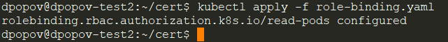

# Домашнее задание к занятию "12.2 Команды для работы с Kubernetes"
Кластер — это сложная система, с которой крайне редко работает один человек. Квалифицированный devops умеет наладить работу всей команды, занимающейся каким-либо сервисом.
После знакомства с кластером вас попросили выдать доступ нескольким разработчикам. Помимо этого требуется служебный аккаунт для просмотра логов.

## Задание 1: Запуск пода из образа в деплойменте
Для начала следует разобраться с прямым запуском приложений из консоли. Такой подход поможет быстро развернуть инструменты отладки в кластере. Требуется запустить деплоймент на основе образа из hello world уже через deployment. Сразу стоит запустить 2 копии приложения (replicas=2). 

Требования:
 * пример из hello world запущен в качестве deployment
 * количество реплик в deployment установлено в 2
 * наличие deployment можно проверить командой kubectl get deployment
 * наличие подов можно проверить командой kubectl get pods

 * Для начала проверяем количество pods и deployments приложения hello-node


- Устанавливаем количество реплик приложения командой `kubectl edit deployment hello-node`


* Проверяем измененное c 1 на 2 количество pods и deployments приложения `hello-node`


## Задание 2: Просмотр логов для разработки
Разработчикам крайне важно получать обратную связь от штатно работающего приложения и, еще важнее, об ошибках в его работе. 
Требуется создать пользователя и выдать ему доступ на чтение конфигурации и логов подов в app-namespace.

Требования: 
 * создан новый токен доступа для пользователя
 * пользователь прописан в локальный конфиг (~/.kube/config, блок users)
 * пользователь может просматривать логи подов и их конфигурацию (kubectl logs pod <pod_id>, kubectl describe pod <pod_id>)
 
* Сначала генерируем ключ


* Генерируем CSR и сертификат


* Теперь создадим пользователя и контекст


* Поверим конфигурацию:

```shell
apiVersion: v1
clusters:
- cluster:
    certificate-authority: /home/dpopov/.minikube/ca.crt
    extensions:
    - extension:
        last-update: Fri, 21 Oct 2022 16:57:35 MSK
        provider: minikube.sigs.k8s.io
        version: v1.27.1
      name: cluster_info
    server: https://192.168.49.2:8443
  name: minikube
contexts:
- context:
    cluster: minikube
    extensions:
    - extension:
        last-update: Fri, 21 Oct 2022 16:57:35 MSK
        provider: minikube.sigs.k8s.io
        version: v1.27.1
      name: context_info
    namespace: default
    user: minikube
  name: minikube
- context:
    cluster: minikube
    user: user1
  name: user1-context
- context:
    cluster: minikube
    user: user2
  name: user2-context
current-context: minikube
kind: Config
preferences: {}
users:
- name: minikube
  user:
    client-certificate: /home/dpopov/.minikube/profiles/minikube/client.crt
    client-key: /home/dpopov/.minikube/profiles/minikube/client.key
- name: user1
  user:
    client-certificate: /home/dpopov/cert/user1.crt
    client-key: /home/dpopov/cert/user1.key
- name: user2
  user:
    client-certificate: /home/dpopov/cert/user2.crt
    client-key: /home/dpopov/cert/user2.key

```

* Переключимся на контекст `user2-context` и проверим, что мы находимся в нем


* Проверим, что наш пользователь ограничен в действиях


* Добавляем права пользователю `user2`, созданим файлы role.yaml и role-binding.yaml

- role.yaml
```shell
kind: Role
apiVersion: rbac.authorization.k8s.io/v1
metadata:
  namespace: default
  name: pod-reader
rules:
- apiGroups: [“”]
  resources: [“pods”]
  verbs: [“get”, “watch”, “list”]
```
- role-binding.yaml
```shell
kind: RoleBinding
apiVersion: rbac.authorization.k8s.io/v1
metadata:
  name: read-pods
  namespace: default
subjects:
- kind: User
  name: user2
  apiGroup: rbac.authorization.k8s.io
roleRef:
  kind: Role
  name: pod-reader
  apiGroup: rbac.authorization.k8s.io
```

* Для применения настроек вернемся в контекст `minikube` и применим файлы настроек командой `kubectl apply -f role.yaml && kubectl apply -f role-binding.yaml`



* Проверим правильность применения ролей


* Протестируем новую роль


## Задание 3: Изменение количества реплик 
Поработав с приложением, вы получили запрос на увеличение количества реплик приложения для нагрузки. Необходимо изменить запущенный deployment, увеличив количество реплик до 5. Посмотрите статус запущенных подов после увеличения реплик. 

Требования:
 * в deployment из задания 1 изменено количество реплик на 5
 * проверить что все поды перешли в статус running (kubectl get pods)


* Увеличим количество реплик приложения до 5 при помощи команды `kubectl edit deployment hello-node`


* Проверим количество реплик


---

### Как оформить ДЗ?

Выполненное домашнее задание пришлите ссылкой на .md-файл в вашем репозитории.

---
