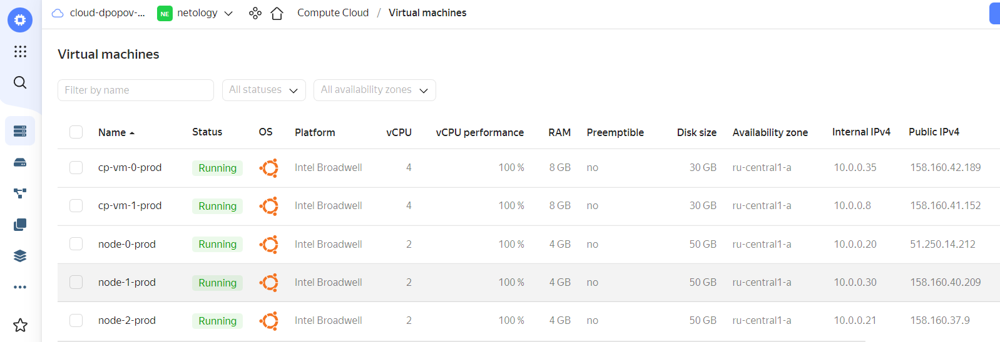
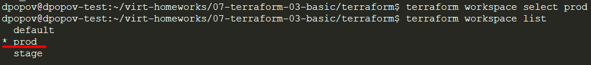

# Домашнее задание к занятию "12.4 Развертывание кластера на собственных серверах, лекция 2"
Новые проекты пошли стабильным потоком. Каждый проект требует себе несколько кластеров: под тесты и продуктив. Делать все руками — не вариант, поэтому стоит автоматизировать подготовку новых кластеров.

## Задание 1: Подготовить инвентарь kubespray
Новые тестовые кластеры требуют типичных простых настроек. Нужно подготовить инвентарь и проверить его работу. Требования к инвентарю:
* подготовка работы кластера из 5 нод: 1 мастер и 4 рабочие ноды;
* в качестве CRI — containerd;
* запуск etcd производить на мастере.

    - Для выполнения этого задания подготовим вручную 5 хостов на Yandex Cloud



- Теперь подготовим конфигурацию kubespray для установки кластера
- Клонируем kuberspray командой `git clone https://github.com/kubernetes-sigs/kubespray`
- Скопируем шаблон конфигурации:

```shell
cd kubespray
cp -rf inventory/sample inventory/test
```

- Создадим инвентори хостов:
```shell
all:
  hosts:
    node1:
      ansible_host: 158.160.42.189
      ip: 10.0.0.35
      ansible_user: ubuntu
    node2:
      ansible_host: 158.160.41.152
      ip: 10.0.0.8
      ansible_user: ubuntu
    node3:
      ansible_host: 51.250.14.212
      ip: 10.0.0.20
      ansible_user: ubuntu
    node4:
      ansible_host: 158.160.40.209
      ip: 10.0.0.30
      ansible_user: ubuntu
    node5:
      ansible_host: 158.160.37.9
      ip: 10.0.0.21
      ansible_user: ubuntu
  children:
    kube_control_plane:
      hosts:
        node1:
    kube_node:
      hosts:
        node2:
        node3:
        node4:
        node5:
    etcd:
      hosts:
        node1:
    k8s_cluster:
      children:
        kube_control_plane:
        kube_node:
    calico_rr:
      hosts: {}
```
- Запустим установку кластера командой `ansible-playbook -i inventory/mycluster/hosts.yaml cluster.yml -b -v`
- После этого необходимо проверить все ли запустилось и работает:
```shell
# Подключаемся к control plane
ssh ubuntu@158.160.42.189
#Входим под root
root@node1:~# sudo -i 
#Проверяем работу кластера
root@node1:~# kubectl get services -o wide -A
NAMESPACE     NAME         TYPE        CLUSTER-IP   EXTERNAL-IP   PORT(S)                  AGE   SELECTOR
default       kubernetes   ClusterIP   10.233.0.1   <none>        443/TCP                  47m   <none>
kube-system   coredns      ClusterIP   10.233.0.3   <none>        53/UDP,53/TCP,9153/TCP   44m   k8s-app=kube-dns

root@node1:~# kubectl get nodes -o wide -A
NAME    STATUS   ROLES           AGE   VERSION   INTERNAL-IP   EXTERNAL-IP   OS-IMAGE             KERNEL-VERSION      CONTAINER-RUNTIME
node1   Ready    control-plane   46m   v1.25.3   10.0.0.35     <none>        Ubuntu 20.04.4 LTS   5.4.0-124-generic   containerd://1.6.9
node2   Ready    <none>          45m   v1.25.3   10.0.0.8      <none>        Ubuntu 20.04.4 LTS   5.4.0-124-generic   containerd://1.6.9
node3   Ready    <none>          45m   v1.25.3   10.0.0.20     <none>        Ubuntu 20.04.4 LTS   5.4.0-124-generic   containerd://1.6.9
node4   Ready    <none>          45m   v1.25.3   10.0.0.30     <none>        Ubuntu 20.04.4 LTS   5.4.0-124-generic   containerd://1.6.9
node5   Ready    <none>          45m   v1.25.3   10.0.0.21     <none>        Ubuntu 20.04.4 LTS   5.4.0-124-generic   containerd://1.6.9


root@node1:~# kubectl get pods -o wide -A
NAMESPACE     NAME                                      READY   STATUS    RESTARTS      AGE   IP               NODE    NOMINATED NODE   READINESS GATES
kube-system   calico-kube-controllers-d6484b75c-9j6l8   1/1     Running   0             42m   10.233.75.1      node2   <none>           <none>
kube-system   calico-node-4mfzw                         1/1     Running   0             43m   10.0.0.20        node3   <none>           <none>
kube-system   calico-node-5xs7g                         1/1     Running   0             43m   10.0.0.8         node2   <none>           <none>
kube-system   calico-node-6wmtp                         1/1     Running   0             43m   10.0.0.30        node4   <none>           <none>
kube-system   calico-node-rnhcp                         1/1     Running   0             43m   10.0.0.21        node5   <none>           <none>
kube-system   calico-node-zbl2r                         1/1     Running   0             43m   10.0.0.35        node1   <none>           <none>
kube-system   coredns-69dfc8446-hllwq                   1/1     Running   0             41m   10.233.75.2      node2   <none>           <none>
kube-system   coredns-69dfc8446-hvrq6                   1/1     Running   0             42m   10.233.102.129   node1   <none>           <none>
kube-system   dns-autoscaler-5b9959d7fc-ll2lk           1/1     Running   0             41m   10.233.102.130   node1   <none>           <none>
kube-system   kube-apiserver-node1                      1/1     Running   1             45m   10.0.0.35        node1   <none>           <none>
kube-system   kube-controller-manager-node1             1/1     Running   2 (44m ago)   45m   10.0.0.35        node1   <none>           <none>
kube-system   kube-proxy-25j46                          1/1     Running   0             43m   10.0.0.30        node4   <none>           <none>
kube-system   kube-proxy-gz8zg                          1/1     Running   0             43m   10.0.0.8         node2   <none>           <none>
kube-system   kube-proxy-kvz5l                          1/1     Running   0             43m   10.0.0.20        node3   <none>           <none>
kube-system   kube-proxy-pqkp8                          1/1     Running   0             43m   10.0.0.35        node1   <none>           <none>
kube-system   kube-proxy-qrhbr                          1/1     Running   0             43m   10.0.0.21        node5   <none>           <none>
kube-system   kube-scheduler-node1                      1/1     Running   1             45m   10.0.0.35        node1   <none>           <none>
kube-system   nginx-proxy-node2                         1/1     Running   0             42m   10.0.0.8         node2   <none>           <none>
kube-system   nginx-proxy-node3                         1/1     Running   0             42m   10.0.0.20        node3   <none>           <none>
kube-system   nginx-proxy-node4                         1/1     Running   0             42m   10.0.0.30        node4   <none>           <none>
kube-system   nginx-proxy-node5                         1/1     Running   0             42m   10.0.0.21        node5   <none>           <none>
kube-system   nodelocaldns-b79bm                        1/1     Running   0             41m   10.0.0.21        node5   <none>           <none>
kube-system   nodelocaldns-mv4rk                        1/1     Running   0             41m   10.0.0.35        node1   <none>           <none>
kube-system   nodelocaldns-qr45w                        1/1     Running   0             41m   10.0.0.20        node3   <none>           <none>
kube-system   nodelocaldns-rb8tl                        1/1     Running   0             41m   10.0.0.30        node4   <none>           <none>
kube-system   nodelocaldns-tgv92                        1/1     Running   0             41m   10.0.0.8         node2   <none>           <none>
```

## Задание 2 (*): подготовить и проверить инвентарь для кластера в AWS
Часть новых проектов хотят запускать на мощностях AWS. Требования похожи:
* разворачивать 5 нод: 1 мастер и 4 рабочие ноды;
* работать должны на минимально допустимых EC2 — t3.small.

  * Произведем автоматическую установку при помощи Terraform:
  * Для этого подготовим манифест инфраструктуры `main.tf`, переменные для манифеста`vars.tf` и файл с секретами `terraform.vfvars`

<details>
<summary>main.tf</summary>

```json
terraform {
  required_providers {
    yandex = {
      source = "yandex-cloud/yandex"
    }
  }
  required_version = ">= 0.13"
}

provider "yandex" {
  token         = var.yc_token
  cloud_id      = var.yc_cloud_id
  zone          = var.yc_region
  folder_id     = var.yc_folder_id
}


resource "yandex_compute_image" "my_image" {
  description   = "Test image"
  source_family = "ubuntu-2004-lts"
  folder_id     = var.yc_folder_id
  min_disk_size = 10
  os_type       = "linux"
}


locals {
  instance = {
    default     = 0
    prod        = 2
    stage       = 1
  }
}

resource "yandex_compute_instance" "master" {
  name = "cp-vm-${count.index}-${terraform.workspace}"
  zone = "ru-central1-a"

  resources {
    cores  = 4
    memory = 8
  }

  boot_disk {
    initialize_params {
      image_id  = "${yandex_compute_image.my_image.id}"
      size      = 30
    }
  }

  network_interface {
    subnet_id = yandex_vpc_subnet.subnet10.id
    nat       = true
  }

  metadata = {
    ssh-keys = "${var.ssh_user}:${file("~/.ssh/id_rsa.pub")}"
  }
  count         = local.instance[terraform.workspace]
}


locals {
  id = toset([
  "0",
  "1",
  "2",
  ])
}


resource "yandex_compute_instance" "node" {

  for_each      = local.id
  name          = "node-${each.key}-${terraform.workspace}"

  lifecycle {
    create_before_destroy = true
  }

  resources {
    cores       = 2
    memory      = 4
  }

  boot_disk {
    initialize_params {
      image_id  = "${yandex_compute_image.my_image.id}"
      size = 50
    }
  }

  network_interface {
    subnet_id   = yandex_vpc_subnet.subnet10.id
    nat         = true
  }

  metadata = {
    ssh-keys = "ubuntu:${file("~/.ssh/id_rsa.pub")}"
  }

}


resource "yandex_vpc_network" "test_network" {
  name = "test-net"
}

resource "yandex_vpc_subnet" "subnet10" {
  v4_cidr_blocks = ["10.0.0.0/16"]
  zone           = "ru-central1-a"
  network_id     = "${yandex_vpc_network.test_network.id}"
}


// Create SA
resource "yandex_iam_service_account" "sa" {
  folder_id = "${var.yc_folder_id}"
  name      = "tf-test-sa"
}

// Grant permissions
resource "yandex_resourcemanager_folder_iam_member" "sa-editor" {
  folder_id = "${var.yc_folder_id}"
  role      = "storage.editor"
  member    = "serviceAccount:${yandex_iam_service_account.sa.id}"
}

// Create Static Access Keys
resource "yandex_iam_service_account_static_access_key" "sa-static-key" {
  service_account_id = yandex_iam_service_account.sa.id
  description        = "static access key for object storage"
}

// Use keys to create bucket
resource "yandex_storage_bucket" "stage732-1235gwosn" {
  access_key = yandex_iam_service_account_static_access_key.sa-static-key.access_key
  secret_key = yandex_iam_service_account_static_access_key.sa-static-key.secret_key
  bucket = "bigbucket"
}
```
</details>

<details>
<summary>vars.tf</summary>

```json
variable "yc_token" {
   default = ""
}

variable "yc_cloud_id" {
  default = ""
}

variable "yc_folder_id" {
  default = ""
}

variable "yc_region" {
  default = ""
}

variable "ssh_user" {
  default = ""
}

```
</details>

<details>
<summary>terraform.tfvars</summary>

```json
yc_token = "secret"
yc_cloud_id = "secret"
yc_folder_id = "secret"
yc_region = "ru-central1-a"
ssh_user = "ubuntu"
```
</details>

* Переключаемся в нужный воркспейс Terraform командой `terraform workspace select prod`
* Проверяем, что мы находимся в необходимом нам воркспейсе:



* После подготовки конфигурации Terraform запускаем команду `terraform apply --var-file=terraform.tfvars`
* Далее следует повторно выполнить установку кластера при помощи Kubespray
* Для этого заходим в директорию с подготовленным Kubespray, меняем айпи хостов в инвентори для кластера и запускаем команду из Задания 1 `ansible-playbook -i inventory/test/hosts.yaml cluster.yml -b -v`
* Успех!


---

### Как оформить ДЗ?

Выполненное домашнее задание пришлите ссылкой на .md-файл в вашем репозитории.

---
