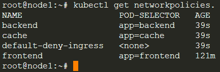
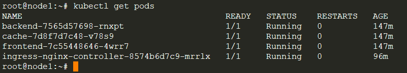
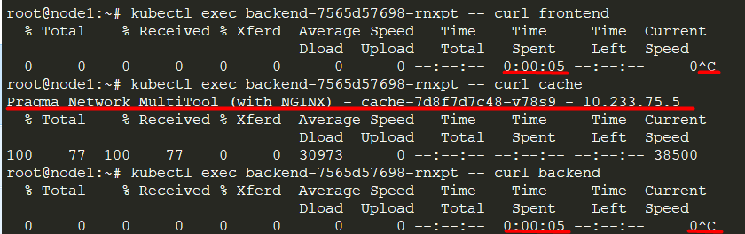
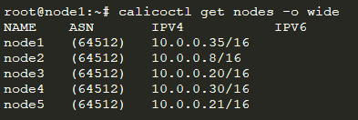
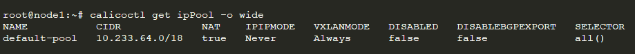
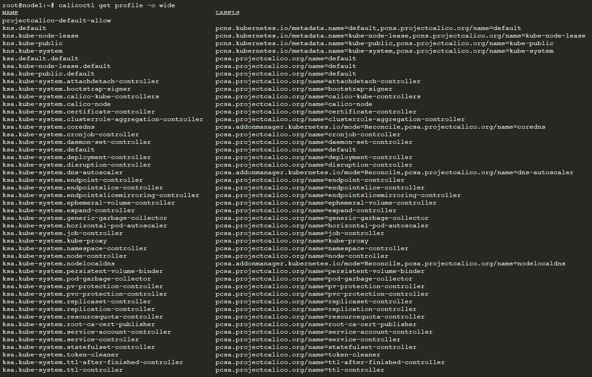

# Домашнее задание к занятию "12.5 Сетевые решения CNI"
После работы с Flannel появилась необходимость обеспечить безопасность для приложения. Для этого лучше всего подойдет Calico.
## Задание 1: установить в кластер CNI плагин Calico
Для проверки других сетевых решений стоит поставить отличный от Flannel плагин — например, Calico. Требования: 
* установка производится через ansible/kubespray;
  * Для установки CNI _Calico_ в конфигурации inventory/test/hosts.yaml указываем следующий параметр:

```shell
calico_rr:
      hosts: {}
```

* после применения следует настроить политику доступа к hello-world извне. Инструкции [kubernetes.io](https://kubernetes.io/docs/concepts/services-networking/network-policies/), [Calico](https://docs.projectcalico.org/about/about-network-policy)

  * Запускаем тестовые приложения _frontend_, _backend_ и _cache_

`kubectl apply -f frontend.yaml`
<details>
  <summary>frontend.yaml</summary>

```shell
---
apiVersion: v1
kind: Service
metadata:
  name: frontend
  namespace: default
spec:
  ports:
    - name: web
      port: 80
  selector:
    app: frontend
```
</details>

`kubectl apply -f backend.yaml`
<details>
  <summary>backend.yaml</summary>

```shell
apiVersion: apps/v1
kind: Deployment
metadata:
  labels:
    app: backend
  name: backend
  namespace: default
spec:
  replicas: 1
  selector:
    matchLabels:
      app: backend
  template:
    metadata:
      labels:
        app: backend
    spec:
      containers:
        - image: praqma/network-multitool:alpine-extra
          imagePullPolicy: IfNotPresent
          name: network-multitool
      terminationGracePeriodSeconds: 30

</details>

---
apiVersion: v1
kind: Service
metadata:
  name: backend
  namespace: default
spec:
  ports:
    - name: web
      port: 80
  selector:
    app: backend
```
</details>

`kubectl apply -f cache.yaml`
<details>
  <summary>cache.yaml</summary>

```shell
  apiVersion: apps/v1
kind: Deployment
metadata:
  labels:
    app: cache
  name: cache
  namespace: default
spec:
  replicas: 1
  selector:
    matchLabels:
      app: cache
  template:
    metadata:
      labels:
        app: cache
    spec:
      containers:
        - image: praqma/network-multitool:alpine-extra
          imagePullPolicy: IfNotPresent
          name: network-multitool
      terminationGracePeriodSeconds: 30
```
</details>

* Применяем политики для _frontend_, _backend_ и _cache_

`kubectl apply -f 00-default.yaml`
<details>
<summary>00-default.yaml</summary>

```shell
---
apiVersion: v1
kind: Service
metadata:
  name: cache
  namespace: default
spec:
  ports:
    - name: web
      port: 80
  selector:
    app: cache
```
</details>

`kubectl apply -f 10-frontend.yaml`
<details>
<summary>10-frontend.yaml</summary>

```shell
apiVersion: networking.k8s.io/v1
kind: NetworkPolicy
metadata:
  name: frontend
  namespace: default
spec:
  podSelector:
    matchLabels:
      app: frontend
  policyTypes:
    - Ingress
ingress:
  ports:
        - protocol: TCP
          port: 80
        - protocol: TCP
          port: 443

```
</details>

`kubectl apply -f 20-backend.yaml`
<details>
<summary>20-backend.yaml</summary>

```shell
apiVersion: networking.k8s.io/v1
kind: NetworkPolicy
metadata:
  name: backend
  namespace: default
spec:
  podSelector:
    matchLabels:
      app: backend
  policyTypes:
    - Ingress
  ingress:
    - from:
      - podSelector:
          matchLabels:
            app: frontend
      ports:
        - protocol: TCP
          port: 80
        - protocol: TCP
          port: 443

```
</details>

`kubectl apply -f 30-cache.yaml`
<details>
<summary>30-cache.yaml</summary>

```shell
apiVersion: networking.k8s.io/v1
kind: NetworkPolicy
metadata:
  name: cache
  namespace: default
spec:
  podSelector:
    matchLabels:
      app: cache
  policyTypes:
    - Ingress
    - Egress
  ingress:
    - from:
      - podSelector:
          matchLabels:
            app: backend
      ports:
        - protocol: TCP
          port: 80
        - protocol: TCP
          port: 443

```
</details>

* Проверяем готовность подов и политик

* Убедимся, что примененные _networkpolicies_ работают



* Проверим список запущенных подов



* Проверим доступность подов с пода _frontend_



  * Скриншот показывает, что с бэкэнда доступен только _cache_ , что соответствует примененным _networkpolicies_

## Задание 2: изучить, что запущено по умолчанию
Самый простой способ — проверить командой calicoctl get <type>. Для проверки стоит получить список нод, ipPool и profile.
Требования: 
* установить утилиту calicoctl;
* получить 3 вышеописанных типа в консоли.

  * Установим _calicoctl_:
  * Выполняем следующий блок команд:
```shell
wget https://github.com/projectcalico/calicoctl/releases/download/v3.20.0/calicoctl
chmod +x calicoctl
sudo mv calicoctl /usr/local/bin/
```

* Настаиваем переменные окружения:

```shell
export KUBECONFIG=/root/.kube/config
export DATASTORE_TYPE=kubernetes
```

* Получаем информацию. По нодам:



* По пулам айпи:



* По _profile_



### Как оформить ДЗ?

Выполненное домашнее задание пришлите ссылкой на .md-файл в вашем репозитории.
