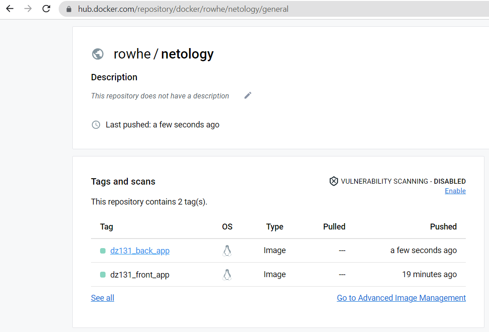

# Домашнее задание к занятию "13.1 контейнеры, поды, deployment, statefulset, services, endpoints"
Настроив кластер, подготовьте приложение к запуску в нём. Приложение стандартное: бекенд, фронтенд, база данных. Его можно найти в папке 13-kubernetes-config.

* Немного исправляем [Dockerfile](13-kubernetes-config/frontend/Dockerfile), добавляем:
```text
ENV NODE_OPTIONS=--openssl-legacy-provider
RUN npx browserslist@latest --update-db
```

* Собираем образы приложений и пушим их на _hub.docker.io_ :
```shell
cd /devkub-homeworks/13-kubernetes-config/frontapp
docker build -t rowhe/netology:dz131_front_app .
...
docker push rowhe/netology:dz131_front_app
...
cd ../backend
docker build -t rowhe/netology:dz131_back_app .
...
docker push rowhe/netology:dz131_back_app
...
```

* Проверяем, что все загрузилось на _hub.docker.io_

* 

## Задание 1: подготовить тестовый конфиг для запуска приложения
Для начала следует подготовить запуск приложения в stage окружении с простыми настройками. Требования:
* под содержит в себе 2 контейнера — фронтенд, бекенд;
* регулируется с помощью deployment фронтенд и бекенд;
  
  * Создаем файл [`front_and_back.yaml`](13-kubernetes-config/stage/front_and_back.yaml)
  * Запускаем фронт и бэк в одном поде:

```shell
root@node1:~/devkub-homeworks/13-kubernetes-config# kubectl apply -f front_and_back.yaml
deployment.apps/front-and-back-deployment created
service/front-and-back created
```
   * Проверяем работу деплоймента, сервиса, пода и получаем их описание:

<details>
<summary>Лог</summary>

```shell
root@node1:~# kubectl get pods -o wide
NAME                                         READY   STATUS    RESTARTS   AGE     IP            NODE    NOMINATED NODE   READINESS GATES
front-and-back-deployment-68c664c8c9-rjsdg   2/2     Running   0          5m42s   10.233.75.7   node2   <none>           <none>

root@node1:~# kubectl describe pods front-and-back-deployment-68c664c8c9-rjsdg
Name:             front-and-back-deployment-68c664c8c9-rjsdg
Namespace:        default
Priority:         0
Service Account:  default
Node:             node2/10.0.0.20
Start Time:       Tue, 06 Dec 2022 14:05:52 +0000
Labels:           app=front-and-back
                  pod-template-hash=68c664c8c9
Annotations:      cni.projectcalico.org/containerID: 82a12a2e1672e5af5fc2663657b88c332c900550f2736f4d6a965cc6203683ed
                  cni.projectcalico.org/podIP: 10.233.75.7/32
                  cni.projectcalico.org/podIPs: 10.233.75.7/32
Status:           Running
IP:               10.233.75.7
IPs:
  IP:           10.233.75.7
Controlled By:  ReplicaSet/front-and-back-deployment-68c664c8c9
Containers:
  front:
    Container ID:   containerd://57f1140d54b2f378ceb42a85e8316aff92977a750264f03d7980e4c6651d5ae6
    Image:          rowhe/netology:dz131_front_app
    Image ID:       docker.io/rowhe/netology@sha256:fa299ba2c5eb2b2178bb469fb63e81220f07a77b7a8e713de1a18b26da24f312
    Port:           80/TCP
    Host Port:      0/TCP
    State:          Running
      Started:      Tue, 06 Dec 2022 14:05:53 +0000
    Ready:          True
    Restart Count:  0
    Environment:    <none>
    Mounts:
      /var/run/secrets/kubernetes.io/serviceaccount from kube-api-access-8j6lj (ro)
  back:
    Container ID:  containerd://e3acc403d074e6f37184db9304411f043991dc8bbf53d5456b4c2d3eec143901
    Image:         rowhe/netology:dz131_back_app
    Image ID:      docker.io/rowhe/netology@sha256:a71838ceace073deebd8f1b2f1437c25b161a0525c3454aabb99acd8786883d3
    Port:          <none>
    Host Port:     <none>
    Command:
      sleep
      3600
    State:          Running
      Started:      Tue, 06 Dec 2022 14:05:53 +0000
    Ready:          True
    Restart Count:  0
    Environment:    <none>
    Mounts:
      /var/run/secrets/kubernetes.io/serviceaccount from kube-api-access-8j6lj (ro)
Conditions:
  Type              Status
  Initialized       True
  Ready             True
  ContainersReady   True
  PodScheduled      True
Volumes:
  kube-api-access-8j6lj:
    Type:                    Projected (a volume that contains injected data from multiple sources)
    TokenExpirationSeconds:  3607
    ConfigMapName:           kube-root-ca.crt
    ConfigMapOptional:       <nil>
    DownwardAPI:             true
QoS Class:                   BestEffort
Node-Selectors:              <none>
Tolerations:                 node.kubernetes.io/not-ready:NoExecute op=Exists for 300s
                             node.kubernetes.io/unreachable:NoExecute op=Exists for 300s
Events:
  Type    Reason     Age    From               Message
  ----    ------     ----   ----               -------
  Normal  Scheduled  5m53s  default-scheduler  Successfully assigned default/front-and-back-deployment-68c664c8c9-rjsdg to node2
  Normal  Pulled     5m53s  kubelet            Container image "rowhe/netology:dz131_front_app" already present on machine
  Normal  Created    5m53s  kubelet            Created container front
  Normal  Started    5m53s  kubelet            Started container front
  Normal  Pulled     5m53s  kubelet            Container image "rowhe/netology:dz131_back_app" already present on machine
  Normal  Created    5m53s  kubelet            Created container back
  Normal  Started    5m53s  kubelet            Started container back

root@node1:~# kubectl get deployments.apps -o wide
NAME                        READY   UP-TO-DATE   AVAILABLE   AGE    CONTAINERS   IMAGES                                                         SELECTOR
front-and-back-deployment   1/1     1            1           6m4s   front,back   rowhe/netology:dz131_front_app,rowhe/netology:dz131_back_app   app=front-and-back

root@node1:~# kubectl describe deployments.apps front-and-back-deployment
Name:                   front-and-back-deployment
Namespace:              default
CreationTimestamp:      Tue, 06 Dec 2022 14:05:52 +0000
Labels:                 app=front-and-back
Annotations:            deployment.kubernetes.io/revision: 1
Selector:               app=front-and-back
Replicas:               1 desired | 1 updated | 1 total | 1 available | 0 unavailable
StrategyType:           RollingUpdate
MinReadySeconds:        0
RollingUpdateStrategy:  25% max unavailable, 25% max surge
Pod Template:
  Labels:  app=front-and-back
  Containers:
   front:
    Image:        rowhe/netology:dz131_front_app
    Port:         80/TCP
    Host Port:    0/TCP
    Environment:  <none>
    Mounts:       <none>
   back:
    Image:      rowhe/netology:dz131_back_app
    Port:       <none>
    Host Port:  <none>
    Command:
      sleep
      3600
    Environment:  <none>
    Mounts:       <none>
  Volumes:        <none>
Conditions:
  Type           Status  Reason
  ----           ------  ------
  Available      True    MinimumReplicasAvailable
  Progressing    True    NewReplicaSetAvailable
OldReplicaSets:  <none>
NewReplicaSet:   front-and-back-deployment-68c664c8c9 (1/1 replicas created)
Events:
  Type    Reason             Age    From                   Message
  ----    ------             ----   ----                   -------
  Normal  ScalingReplicaSet  6m15s  deployment-controller  Scaled up replica set front-and-back-deployment-68c664c8c9 to 1

root@node1:~# kubectl get service -o wide
NAME             TYPE        CLUSTER-IP     EXTERNAL-IP   PORT(S)        AGE     SELECTOR
front-and-back   NodePort    10.233.6.139   <none>        80:30080/TCP   7m55s   app=front-and-back
kubernetes       ClusterIP   10.233.0.1     <none>        443/TCP        3h29m   <none>

root@node1:~# kubectl describe service front-and-back
Name:                     front-and-back
Namespace:                default
Labels:                   app=front-and-back
Annotations:              <none>
Selector:                 app=front-and-back
Type:                     NodePort
IP Family Policy:         SingleStack
IP Families:              IPv4
IP:                       10.233.6.139
IPs:                      10.233.6.139
Port:                     <unset>  80/TCP
TargetPort:               80/TCP
NodePort:                 <unset>  30080/TCP
Endpoints:                10.233.75.7:80
Session Affinity:         None
External Traffic Policy:  Cluster
Events:                   <none>
root@node1:~#
```
</details>
   * база данных — через statefulset.

## Задание 2: подготовить конфиг для production окружения
Следующим шагом будет запуск приложения в production окружении. Требования сложнее:
* каждый компонент (база, бекенд, фронтенд) запускаются в своем поде, регулируются отдельными deployment’ами;
* для связи используются service (у каждого компонента свой);
* в окружении фронта прописан адрес сервиса бекенда;
* в окружении бекенда прописан адрес сервиса базы данных.

## Задание 3 (*): добавить endpoint на внешний ресурс api
Приложению потребовалось внешнее api, и для его использования лучше добавить endpoint в кластер, направленный на это api. Требования:
* добавлен endpoint до внешнего api (например, геокодер).

---

### Как оформить ДЗ?

Выполненное домашнее задание пришлите ссылкой на .md-файл в вашем репозитории.

В качестве решения прикрепите к ДЗ конфиг файлы для деплоя. Прикрепите скриншоты вывода команды kubectl со списком запущенных объектов каждого типа (pods, deployments, statefulset, service) или скриншот из самого Kubernetes, что сервисы подняты и работают.

---
