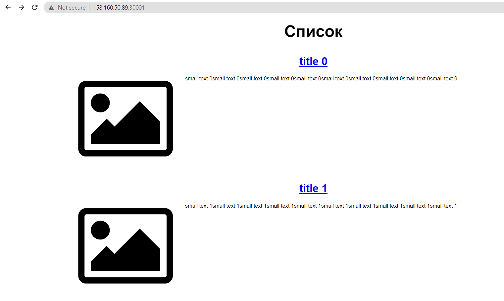
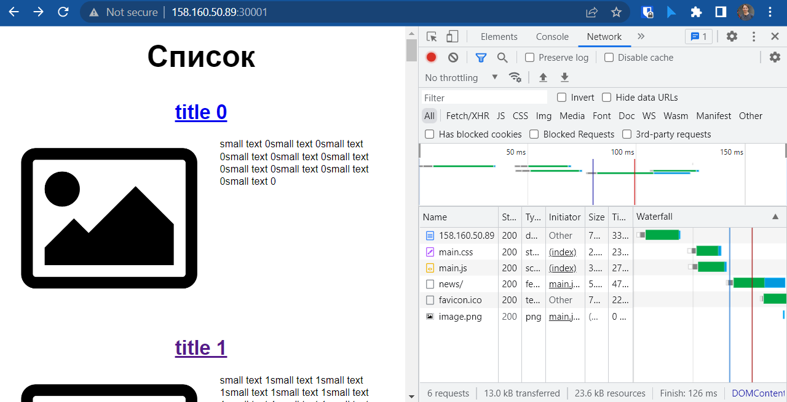

# Домашнее задание к занятию "13.1 контейнеры, поды, deployment, statefulset, services, endpoints"
Настроив кластер, подготовьте приложение к запуску в нём. Приложение стандартное: бекенд, фронтенд, база данных. Его можно найти в папке 13-kubernetes-config.

* Первым дело разворачиваем инфраструктуру в яндекс.облаке при помощи [_Terraform_](13-kubernetes-config/terraform)

* Далее следует развернуть кластер при помощи _Kubespray_, установить nfs-provisioner при помощи Helm (`helm install nfs-server stable/nfs-server-provisioner`)  и драйвера nfs для нод (`apt install nfs-common`)


* Немного исправляем [Dockerfile](13-kubernetes-config/frontend/Dockerfile), добавляем:

```text
ENV NODE_OPTIONS=--openssl-legacy-provider
RUN npx browserslist@latest --update-db
```
* также не забывает про переменные _.env_ для [front](13-kubernetes-config/frontend/.env) и [back](13-kubernetes-config/backend/.env)
* (для облегчения работы с переменной докер имиджа в .env для фронта укажем имя, а не айпи. И пропишем его айпи в локальный файл hosts)

* Собираем образы приложений и пушим их на _hub.docker.io_ :

```shell
cd /devkub-homeworks/13-kubernetes-config/frontapp
docker build -t rowhe/netology:dz131_front_app .
...
docker push rowhe/netology:dz131_front_app
...
cd ../backend
docker build -t rowhe/netology:dz131_back_app .
...
docker push rowhe/netology:dz131_back_app
...
```

* Проверяем, что все загрузилось на _hub.docker.io_


## Задание 1: подготовить тестовый конфиг для запуска приложения
Для начала следует подготовить запуск приложения в stage окружении с простыми настройками. Требования:
* под содержит в себе 2 контейнера — фронтенд, бекенд;
* регулируется с помощью deployment фронтенд и бекенд;
* база данных — через statefulset.
  
  * Создаем файл [`front_and_back.yaml`](13-kubernetes-config/stage/front_and_back.yaml)
  * Запускаем фронт и бэк в одном поде:

```shell
root@node1:~/devkub-homeworks/13-kubernetes-config# kubectl apply -f front_and_back.yaml
deployment.apps/front-and-back-deployment created
service/front-and-back created
```
   * Проверяем работу деплоймента, сервиса, пода и получаем их описание:

<details>
<summary>Лог</summary>

```shell
$ kubectl.exe get po -o wide
NAME                                         READY   STATUS    RESTARTS   AGE     IP             NODE    NOMINATED NODE   READINESS GATES
front-and-back-deployment-66cfd48c7b-wjtnp   2/2     Running   0          15h     10.233.75.10   node2   <none>           <none>
nfs-server-nfs-server-provisioner-0          1/1     Running   0          2d23h   10.233.75.2    node2   <none>           <none>
postgres-0                                   1/1     Running   0          15h     10.233.71.11   node3   <none>           <none>
...

$ kubectl describe po front-and-back-deployment-66cfd48c7b-wjtnp
Name:         front-and-back-deployment-66cfd48c7b-wjtnp
Namespace:    default
Priority:     0
Node:         node2/10.0.0.8
Start Time:   Sun, 11 Dec 2022 23:59:50 +0300
Labels:       app=front-and-back
              pod-template-hash=66cfd48c7b
Annotations:  cni.projectcalico.org/containerID: da59e7eb6728826135ac4000a3ecf24afc9f7904e7161174a3047d703d69c92b
              cni.projectcalico.org/podIP: 10.233.75.10/32
              cni.projectcalico.org/podIPs: 10.233.75.10/32
Status:       Running
IP:           10.233.75.10
IPs:
  IP:           10.233.75.10
Controlled By:  ReplicaSet/front-and-back-deployment-66cfd48c7b
Containers:
  front:
    Container ID:   containerd://329df5842d188b29c9776b40982195c629d3014de88491183bd5eb146a8048d6
    Image:          rowhe/netology:dz131_front_app
    Image ID:       docker.io/rowhe/netology@sha256:94cb9050bf5cc8e7dc1d38a6d29e29f8cc199fed2c1581d46e90ecc938ab4052
    Port:           80/TCP
    Host Port:      0/TCP
    State:          Running
      Started:      Sun, 11 Dec 2022 23:59:52 +0300
    Ready:          True
    Restart Count:  0
    Environment:    <none>
    Mounts:
      /var/run/secrets/kubernetes.io/serviceaccount from kube-api-access-p2skm (ro)
  back:
    Container ID:   containerd://2bf5ba4033b2f1f5c48bede5f4564660220e1bce2bddafd94fe98871510f2e6f
    Image:          rowhe/netology:dz131_back_app
    Image ID:       docker.io/rowhe/netology@sha256:34d4051285af28534130571f3de4e8b2a6ed50b87dbf0bc94649f2e882d4ca1f
    Port:           9000/TCP
    Host Port:      0/TCP
    State:          Running
      Started:      Sun, 11 Dec 2022 23:59:53 +0300
    Ready:          True
    Restart Count:  0
    Environment:    <none>
    Mounts:
      /var/run/secrets/kubernetes.io/serviceaccount from kube-api-access-p2skm (ro)
Conditions:
  Type              Status
  Initialized       True
  Ready             True
  ContainersReady   True
  PodScheduled      True
Volumes:
  kube-api-access-p2skm:
    Type:                    Projected (a volume that contains injected data from multiple sources)
    TokenExpirationSeconds:  3607
    ConfigMapName:           kube-root-ca.crt
    ConfigMapOptional:       <nil>
    DownwardAPI:             true
QoS Class:                   BestEffort
Node-Selectors:              <none>
Tolerations:                 node.kubernetes.io/not-ready:NoExecute op=Exists for 300s
                             node.kubernetes.io/unreachable:NoExecute op=Exists for 300s
Events:                      <none>
...
$ kubectl get deployments -o wide
NAME                        READY   UP-TO-DATE   AVAILABLE   AGE   CONTAINERS   IMAGES                                                         SELECTOR
front-and-back-deployment   1/1     1            1           15h   front,back   rowhe/netology:dz131_front_app,rowhe/netology:dz131_back_app   app=front-and-back

...
$ kubectl describe deployments  front-and-back-deployment
Name:                   front-and-back-deployment
Namespace:              default
CreationTimestamp:      Sun, 11 Dec 2022 23:59:50 +0300
Labels:                 app=front-and-back
Annotations:            deployment.kubernetes.io/revision: 1
Selector:               app=front-and-back
Replicas:               1 desired | 1 updated | 1 total | 1 available | 0 unavailable
StrategyType:           RollingUpdate
MinReadySeconds:        0
RollingUpdateStrategy:  25% max unavailable, 25% max surge
Pod Template:
  Labels:  app=front-and-back
  Containers:
   front:
    Image:        rowhe/netology:dz131_front_app
    Port:         80/TCP
    Host Port:    0/TCP
    Environment:  <none>
    Mounts:       <none>
   back:
    Image:        rowhe/netology:dz131_back_app
    Port:         9000/TCP
    Host Port:    0/TCP
    Environment:  <none>
    Mounts:       <none>
  Volumes:        <none>
Conditions:
  Type           Status  Reason
  ----           ------  ------
  Available      True    MinimumReplicasAvailable
  Progressing    True    NewReplicaSetAvailable
OldReplicaSets:  <none>
NewReplicaSet:   front-and-back-deployment-66cfd48c7b (1/1 replicas created)
Events:          <none>
...

$ kubectl get svc -o wide
NAME                                TYPE        CLUSTER-IP      EXTERNAL-IP   PORT(S)
                   AGE     SELECTOR
back                                NodePort    10.233.52.33    <none>        9000:30002/TCP
                   15h     app=front-and-back
db                                  NodePort    10.233.37.234   <none>        5432:32396/TCP
                   15h     app=postgres
front                               NodePort    10.233.48.176   <none>        80:30001/TCP
                   15h     app=front-and-back
kubernetes                          ClusterIP   10.233.0.1      <none>        443/TCP
                   3d3h    <none>
nfs-server-nfs-server-provisioner   ClusterIP   10.233.22.144   <none>        2049/TCP,2049/UDP,32803/TCP,32803/UDP,20048/TCP,20048/UDP,875/TCP,875/UDP,111/TCP,111/UDP
,662/TCP,662/UDP   2d23h   app=nfs-server-provisioner,release=nfs-server
...

$ kubectl describe svc front
Name:                     front
Namespace:                default
Labels:                   <none>
Annotations:              <none>
Selector:                 app=front-and-back
Type:                     NodePort
IP Family Policy:         SingleStack
IP Families:              IPv4
IP:                       10.233.48.176
IPs:                      10.233.48.176
Port:                     <unset>  80/TCP
TargetPort:               80/TCP
NodePort:                 <unset>  30001/TCP
Endpoints:                10.233.75.10:80
Session Affinity:         None
External Traffic Policy:  Cluster
Events:                   <none>

dpopov@dpopov ~
$ kubectl describe svc back
Name:                     back
Namespace:                default
Labels:                   <none>
Annotations:              <none>
Selector:                 app=front-and-back
Type:                     NodePort
IP Family Policy:         SingleStack
IP Families:              IPv4
IP:                       10.233.52.33
IPs:                      10.233.52.33
Port:                     <unset>  9000/TCP
TargetPort:               9000/TCP
NodePort:                 <unset>  30002/TCP
Endpoints:                10.233.75.10:9000
Session Affinity:         None
External Traffic Policy:  Cluster
Events:                   <none>
...
$ kubectl.exe get ep
NAME                                              ENDPOINTS                                                       AGE
back                                              10.233.75.10:9000                                               16h
cluster.local-nfs-server-nfs-server-provisioner   <none>                                                          2d23h
db                                                10.233.71.11:5432                                               16h
front                                             10.233.75.10:80                                                 16h
kubernetes                                        10.0.0.6:6443                                                   3d4h
nfs-server-nfs-server-provisioner                 10.233.75.2:20048,10.233.75.2:662,10.233.75.2:111 + 9 more...   2d23h

```
  
</details>

* Также запустим [statefulset](13-kubernetes-config/stage/db.yaml) для базы данных и проверим его работу

<details>
<summary>Лог</summary>

```shell
$ kubectl.exe get sts -o wide
NAME                                READY   AGE     CONTAINERS               IMAGES
nfs-server-nfs-server-provisioner   1/1     2d23h   nfs-server-provisioner   quay.io/kubernetes_incubator/nfs-provisioner:v2.3.0
postgres                            1/1     16h     postgres                 postgres:latest
...
$ kubectl.exe describe sts postgres
Name:               postgres
Namespace:          default
CreationTimestamp:  Sun, 11 Dec 2022 23:58:07 +0300
Selector:           app=postgres
Labels:             <none>
Annotations:        <none>
Replicas:           1 desired | 1 total
Update Strategy:    RollingUpdate
  Partition:        0
Pods Status:        1 Running / 0 Waiting / 0 Succeeded / 0 Failed
Pod Template:
  Labels:  app=postgres
  Containers:
   postgres:
    Image:      postgres:latest
    Port:       <none>
    Host Port:  <none>
    Environment:
      POSTGRES_USER:      postgres
      POSTGRES_PASSWORD:  postgres
      POSTGRES_DB:        news
      PGDATA:             /data/pgdata
    Mounts:
      /data from pg-pvc (rw)
  Volumes:  <none>
Volume Claims:
  Name:          pg-pvc
  StorageClass:  nfs
  Labels:        <none>
  Annotations:   <none>
  Capacity:      1Gi
  Access Modes:  [ReadWriteOnce]
Events:          <none>
...

$ kubectl.exe get pvc
NAME                STATUS   VOLUME                                     CAPACITY   ACCESS MODES   STORAGECLASS   AGE
pg-pvc-postgres-0   Bound    pvc-93161d2d-8e5b-45d5-8216-3fdf79d2839d   1Gi        RWO            nfs            16h
...

$ kubectl.exe describe pvc pg-pvc-postgres-0
Name:          pg-pvc-postgres-0
Namespace:     default
StorageClass:  nfs
Status:        Bound
Volume:        pvc-93161d2d-8e5b-45d5-8216-3fdf79d2839d
Labels:        app=postgres
Annotations:   pv.kubernetes.io/bind-completed: yes
               pv.kubernetes.io/bound-by-controller: yes
               volume.beta.kubernetes.io/storage-provisioner: cluster.local/nfs-server-nfs-server-provisioner
               volume.kubernetes.io/storage-provisioner: cluster.local/nfs-server-nfs-server-provisioner
Finalizers:    [kubernetes.io/pvc-protection]
Capacity:      1Gi
Access Modes:  RWO
VolumeMode:    Filesystem
Used By:       postgres-0
Events:        <none>
...

dpopov@dpopov ~
$ kubectl.exe get pv
NAME                                       CAPACITY   ACCESS MODES   RECLAIM POLICY   STATUS   CLAIM                       STORAGECLASS   REASON   AGE
pvc-93161d2d-8e5b-45d5-8216-3fdf79d2839d   1Gi        RWO            Delete           Bound    default/pg-pvc-postgres-0   nfs                     16h
...

$ kubectl.exe describe pv pvc-93161d2d-8e5b-45d5-8216-3fdf79d2839d
Name:            pvc-93161d2d-8e5b-45d5-8216-3fdf79d2839d
Labels:          <none>
Annotations:     EXPORT_block:

                   EXPORT
                   {
                     Export_Id = 1;
                     Path = /export/pvc-93161d2d-8e5b-45d5-8216-3fdf79d2839d;
                     Pseudo = /export/pvc-93161d2d-8e5b-45d5-8216-3fdf79d2839d;
                     Access_Type = RW;
                     Squash = no_root_squash;
                     SecType = sys;
                     Filesystem_id = 1.1;
                     FSAL {
                       Name = VFS;
                     }
                   }
                 Export_Id: 1
                 Project_Id: 0
                 Project_block:
                 Provisioner_Id: 68c8d049-5e3c-4504-b967-34c9f7bf5adb
                 kubernetes.io/createdby: nfs-dynamic-provisioner
                 pv.kubernetes.io/provisioned-by: cluster.local/nfs-server-nfs-server-provisioner
Finalizers:      [kubernetes.io/pv-protection]
StorageClass:    nfs
Status:          Bound
Claim:           default/pg-pvc-postgres-0
Reclaim Policy:  Delete
Access Modes:    RWO
VolumeMode:      Filesystem
Capacity:        1Gi
Node Affinity:   <none>
Message:
Source:
    Type:      NFS (an NFS mount that lasts the lifetime of a pod)
    Server:    10.233.22.144
    Path:      /export/pvc-93161d2d-8e5b-45d5-8216-3fdf79d2839d
    ReadOnly:  false
Events:        <none>

```
</details>

  * Проверяем работу приложения в браузере
    * Получаем список айпи кластера
  ```
  dpopov@dpopov-test:~$ yc compute instance list
+----------------------+---------------+---------------+---------+----------------+-------------+
|          ID          |     NAME      |    ZONE ID    | STATUS  |  EXTERNAL IP   | INTERNAL IP |
+----------------------+---------------+---------------+---------+----------------+-------------+
| fhmb3bb8l6lflrtgf6o4 | node-0-stage  | ru-central1-a | RUNNING | 158.160.42.13  | 10.0.0.8    |
| fhmb7fbl9gdgugqcejqv | cp-vm-0-stage | ru-central1-a | RUNNING | 158.160.50.89  | 10.0.0.6    |
| fhmr9lj22mlhl18g1811 | node-1-stage  | ru-central1-a | RUNNING | 158.160.37.191 | 10.0.0.24   |
+----------------------+---------------+---------------+---------+----------------+-------------+

  ```
* Подключаемся к фротненду через любой айпи кластера браузером



* НАШ КЛАСТЕР И ПРИЛОЖЕНИЯ РАБОТАЮТ КОРРЕКТНО!


## Задание 2: подготовить конфиг для production окружения
Следующим шагом будет запуск приложения в production окружении. Требования сложнее:
* каждый компонент (база, бекенд, фронтенд) запускаются в своем поде, регулируются отдельными deployment’ами;
* для связи используются service (у каждого компонента свой);
* в окружении фронта прописан адрес сервиса бекенда;
* в окружении бекенда прописан адрес сервиса базы данных.

    * Разносим [_front_](13-kubernetes-config/prod/front.yaml) и [_back_](13-kubernetes-config/prod/back.yaml) в разные _deployments_
    * Запускаем приложения и проверям их работу:
```shell
$ kubectl.exe apply -f prod/front.yaml -f prod/back.yaml -f prod/db.yaml
deployment.apps/front-deployment created
service/front created
deployment.apps/back-deployment created
service/backend created
statefulset.apps/postgres created
service/db created
```
<details>
<summary>Лог</summary>

```shell
$ kubectl.exe get deployments
NAME               READY   UP-TO-DATE   AVAILABLE   AGE
back-deployment    1/1     1            1           68s
front-deployment   1/1     1            1           68s

dpopov@dpopov /cygdrive/c/Users/dpopov/Documents/GitHub/devkub-homeworks/13-kubernetes-config/prod
$ kubectl describe deployments
Name:                   back-deployment
Namespace:              default
CreationTimestamp:      Mon, 12 Dec 2022 19:25:28 +0300
Labels:                 app=backend
Annotations:            deployment.kubernetes.io/revision: 1
Selector:               app=backend
Replicas:               1 desired | 1 updated | 1 total | 1 available | 0 unavailable
StrategyType:           RollingUpdate
MinReadySeconds:        0
RollingUpdateStrategy:  25% max unavailable, 25% max surge
Pod Template:
  Labels:  app=backend
  Containers:
   backend:
    Image:        rowhe/netology:dz131_back_app
    Port:         9000/TCP
    Host Port:    0/TCP
    Environment:  <none>
    Mounts:       <none>
  Volumes:        <none>
Conditions:
  Type           Status  Reason
  ----           ------  ------
  Available      True    MinimumReplicasAvailable
  Progressing    True    NewReplicaSetAvailable
OldReplicaSets:  <none>
NewReplicaSet:   back-deployment-c68f75d45 (1/1 replicas created)
Events:
  Type    Reason             Age   From                   Message
  ----    ------             ----  ----                   -------
  Normal  ScalingReplicaSet  83s   deployment-controller  Scaled up replica set back-deployment-c68f75d45 to 1


Name:                   front-deployment
Namespace:              default
CreationTimestamp:      Mon, 12 Dec 2022 19:25:28 +0300
Labels:                 app=front
Annotations:            deployment.kubernetes.io/revision: 1
Selector:               app=front
Replicas:               1 desired | 1 updated | 1 total | 1 available | 0 unavailable
StrategyType:           RollingUpdate
MinReadySeconds:        0
RollingUpdateStrategy:  25% max unavailable, 25% max surge
Pod Template:
  Labels:  app=front
  Containers:
   front:
    Image:        rowhe/netology:dz131_front_app
    Port:         <none>
    Host Port:    <none>
    Environment:  <none>
    Mounts:       <none>
  Volumes:        <none>
Conditions:
  Type           Status  Reason
  ----           ------  ------
  Available      True    MinimumReplicasAvailable
  Progressing    True    NewReplicaSetAvailable
OldReplicaSets:  <none>
NewReplicaSet:   front-deployment-5f6648c57 (1/1 replicas created)
Events:
  Type    Reason             Age   From                   Message
  ----    ------             ----  ----                   -------
  Normal  ScalingReplicaSet  83s   deployment-controller  Scaled up replica set front-deployment-5f6648c57 to 1

$ kubectl.exe get svc -o wide
NAME                                TYPE        CLUSTER-IP      EXTERNAL-IP   PORT(S)
             AGE    SELECTOR
backend                             NodePort    10.233.10.179   <none>        9000:30002/TCP
             2m9s   app=backend
db                                  NodePort    10.233.48.126   <none>        5432:32614/TCP
             2m9s   app=postgres
front                               NodePort    10.233.33.248   <none>        80:30001/TCP
             2m9s   app=front
kubernetes                          ClusterIP   10.233.0.1      <none>        443/TCP
             3d7h   <none>
nfs-server-nfs-server-provisioner   ClusterIP   10.233.22.144   <none>        2049/TCP,2049/UDP,32803/TCP,32803/UDP,20048/TCP,20048/UDP,875/TCP,875/UDP,111/TCP,111/UDP,662/T
CP,662/UDP   3d2h   app=nfs-server-provisioner,release=nfs-server


$ kubectl.exe describe svc front backend db
Name:                     front
Namespace:                default
Labels:                   <none>
Annotations:              <none>
Selector:                 app=front
Type:                     NodePort
IP Family Policy:         SingleStack
IP Families:              IPv4
IP:                       10.233.33.248
IPs:                      10.233.33.248
Port:                     <unset>  80/TCP
TargetPort:               80/TCP
NodePort:                 <unset>  30001/TCP
Endpoints:                10.233.71.17:80
Session Affinity:         None
External Traffic Policy:  Cluster
Events:                   <none>


Name:                     backend
Namespace:                default
Labels:                   <none>
Annotations:              <none>
Selector:                 app=backend
Type:                     NodePort
IP Family Policy:         SingleStack
IP Families:              IPv4
IP:                       10.233.10.179
IPs:                      10.233.10.179
Port:                     <unset>  9000/TCP
TargetPort:               9000/TCP
NodePort:                 <unset>  30002/TCP
Endpoints:                10.233.75.15:9000
Session Affinity:         None
External Traffic Policy:  Cluster
Events:                   <none>


Name:                     db
Namespace:                default
Labels:                   <none>
Annotations:              <none>
Selector:                 app=postgres
Type:                     NodePort
IP Family Policy:         SingleStack
IP Families:              IPv4
IP:                       10.233.48.126
IPs:                      10.233.48.126
Port:                     <unset>  5432/TCP
TargetPort:               5432/TCP
NodePort:                 <unset>  32614/TCP
Endpoints:                10.233.71.18:5432
Session Affinity:         None
External Traffic Policy:  Cluster
Events:                   <none>

```
</details>


   * Проверяем работу кластера подключившись браузером




## Задание 3 (*): добавить endpoint на внешний ресурс api
Приложению потребовалось внешнее api, и для его использования лучше добавить endpoint в кластер, направленный на это api. Требования:
* добавлен endpoint до внешнего api (например, геокодер).

---

### Как оформить ДЗ?

Выполненное домашнее задание пришлите ссылкой на .md-файл в вашем репозитории.

В качестве решения прикрепите к ДЗ конфиг файлы для деплоя. Прикрепите скриншоты вывода команды kubectl со списком запущенных объектов каждого типа (pods, deployments, statefulset, service) или скриншот из самого Kubernetes, что сервисы подняты и работают.

---
