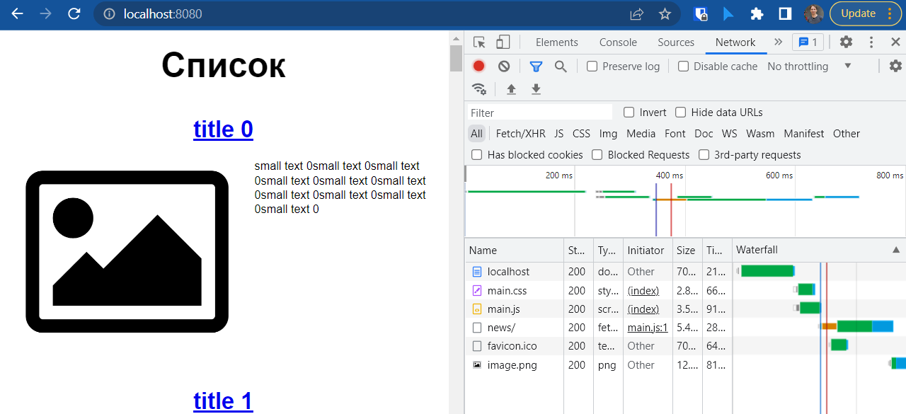
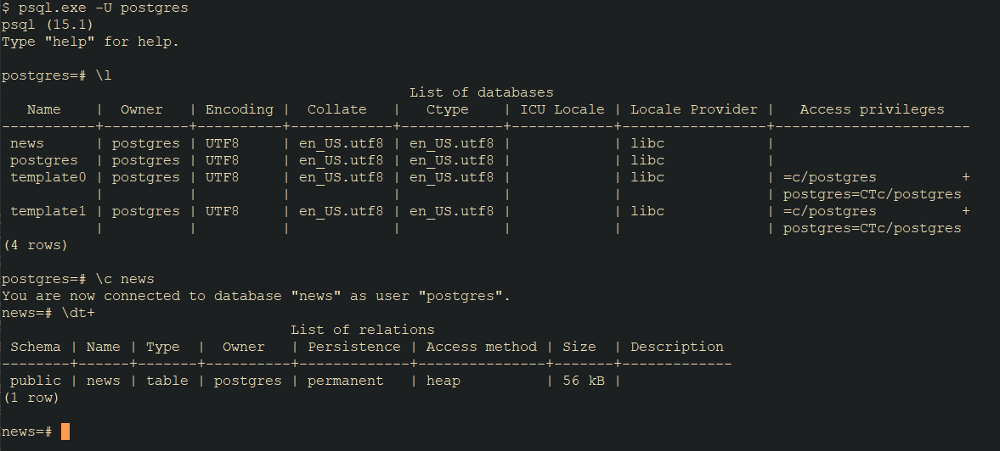

# Домашнее задание к занятию "13.3 работа с kubectl"
## Задание 1: проверить работоспособность каждого компонента
Для проверки работы можно использовать 2 способа: port-forward и exec. Используя оба способа, проверьте каждый компонент:
* сделайте запросы к бекенду;
* сделайте запросы к фронту;
* подключитесь к базе данных.
        
    * Проверим работу бэкэнда, фронтэнда и базы данных
    * Для начала посмотрим список подов

```shell
$ kubectl.exe get po
NAME                                  READY   STATUS    RESTARTS   AGE                            
back-deployment-d85c8cc9-hjd7t        1/1     Running   0          89m                            
front-deployment-5548cdbd67-pvfk2     1/1     Running   0          89m                            
nfs-server-nfs-server-provisioner-0   1/1     Running   0          107m                           
postgres-0                            1/1     Running   0          90m                            
```

  * Как видим запущено три пода. Для начала запустим port-forward к фронтэнду и откроем его в локальном браузере

```shell
$ kubectl.exe port-forward svc/front 8080:80
Forwarding from 127.0.0.1:8080 -> 80
Forwarding from [::1]:8080 -> 80
```
  * Теперь проверим работу в браузере



  * Попробуем зайти на фронт с пода бекэнда

```shell
$ kubectl exec back-deployment-d85c8cc9-hjd7t -- curl front:80
  % Total    % Received % Xferd  Average Speed   Time    Time     Time  Current
                                 Dload  Upload   Total   Spent    Left  Speed  
100   463  10<!DOCTYPE html>  0      0      0 --:--:-- --:--:-- --:--:--     0 
<html lang="ru">                                                          
<head>                                                                    
    <title>Список</title>                                                 
    <meta charset="UTF-8">                                                
    <meta name="viewport" content="width=device-width, initial-scale=1.0">
    <link href="/build/main.css" rel="stylesheet">                        
</head>    
```

  * Как видим фронт доступен и нормально открывается с пода бэкэнда
  * Теперь проверим доступность бэкэнда с фронта

```shell
$ kubectl exec front-deployment-5548cdbd67-pvfk2 -- curl backend:9000
  % Total    % Received % Xferd  Average Speed   Time    Time     Time  Current
                                 Dload  Upload   Total   Spent    Left  Speed  
100    22  100    22    0     0   3142      0 --:--:-- --:--:-- --:--:--  3142 
{"detail":"Not Found"}
```
  * Видим, что бэкэнд нам отвечает.
  * Теперь проверим доступность БД с бэкэнда

```shell
$ kubectl exec back-deployment-d85c8cc9-hjd7t -- telnet db 5432
Trying 10.233.39.140...
Connected to db.default.svc.cluster.local.
Escape character is '^]'.
Connection closed by foreign host.
command terminated with exit code 1
```

  * Видим, что БД доступна и отвечает на 5432 порту
  * Пробуем включить port-forward и подключиться к ней локально

```shell
$ kubectl port-forward pods/postgres-0 5432:5432
Forwarding from 127.0.0.1:5432 -> 5432
Forwarding from [::1]:5432 -> 5432
```
  * Проверим подключение



  * Подключение к базе данных работает!

## Задание 2: ручное масштабирование

При работе с приложением иногда может потребоваться вручную добавить пару копий. Используя команду kubectl scale, попробуйте увеличить количество бекенда и фронта до 3. Проверьте, на каких нодах оказались копии после каждого действия (kubectl describe, kubectl get pods -o wide). После уменьшите количество копий до 1.

  * Проверим имеющееся количество реплик фронта и бэка

```shell
$ kubectl get deployment
NAME               READY   UP-TO-DATE   AVAILABLE   AGE
back-deployment    1/1     1            1           3h28m
front-deployment   1/1     1            1           3h28m
```

  * Увеличим их количество до 3

```shell
$ kubectl scale deployment/front-deployment --replicas=3
deployment.apps/front-deployment scaled

$ kubectl scale deployment/back-deployment --replicas=3
deployment.apps/back-deployment scaled
```

  * Проверим еще раз количество реплик

```shell
$ kubectl get deployment -o wide
NAME               READY   UP-TO-DATE   AVAILABLE   AGE     CONTAINERS   IMAGES                           SELECTOR
back-deployment    3/3     3            3           3h33m   backend      rowhe/netology:dz131_back_app    app=backend
front-deployment   3/3     3            3           3h33m   front        rowhe/netology:dz131_front_app   app=front

$ kubectl get pods -o wide
NAME                                  READY   STATUS    RESTARTS   AGE     IP            NODE    NOMINATED NODE   READINESS GATES
back-deployment-d85c8cc9-hjd7t        1/1     Running   0          3h33m   10.233.75.3   node2   <none>           <none>
back-deployment-d85c8cc9-lbtdt        1/1     Running   0          2m44s   10.233.71.5   node3   <none>           <none>
back-deployment-d85c8cc9-zjn5x        1/1     Running   0          2m44s   10.233.75.5   node2   <none>           <none>
front-deployment-5548cdbd67-7766b     1/1     Running   0          2m51s   10.233.71.4   node3   <none>           <none>
front-deployment-5548cdbd67-hmkrn     1/1     Running   0          2m51s   10.233.75.4   node2   <none>           <none>
front-deployment-5548cdbd67-pvfk2     1/1     Running   0          3h34m   10.233.71.3   node3   <none>           <none>
nfs-server-nfs-server-provisioner-0   1/1     Running   0          3h51m   10.233.71.2   node3   <none>           <none>
postgres-0                            1/1     Running   0          3h35m   10.233.75.2   node2   <none>           <none>
```

  * Вернем исходное количество реплик и проверим их работу

```shell
$ kubectl scale deployment/front-deployment --replicas=1
deployment.apps/front-deployment scaled

$ kubectl scale deployment/back-deployment --replicas=1
deployment.apps/back-deployment scaled

$ kubectl get pods -o wide
NAME                                  READY   STATUS    RESTARTS   AGE     IP            NODE    NOMINATED NODE   READINESS GATES
back-deployment-d85c8cc9-lbtdt        1/1     Running   0          4m45s   10.233.71.5   node3   <none>           <none>
front-deployment-5548cdbd67-hmkrn     1/1     Running   0          4m52s   10.233.75.4   node2   <none>           <none>
nfs-server-nfs-server-provisioner-0   1/1     Running   0          3h53m   10.233.71.2   node3   <none>           <none>
postgres-0                            1/1     Running   0          3h37m   10.233.75.2   node2   <none>           <none>
```

---

### Как оформить ДЗ?

Выполненное домашнее задание пришлите ссылкой на .md-файл в вашем репозитории.

---
