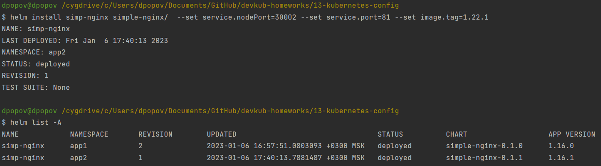

# Домашнее задание к занятию "13.4 инструменты для упрощения написания конфигурационных файлов. Helm и Jsonnet"
В работе часто приходится применять системы автоматической генерации конфигураций. Для изучения нюансов использования разных инструментов нужно попробовать упаковать приложение каждым из них.

## Задание 1: подготовить helm чарт для приложения
Необходимо упаковать приложение в чарт для деплоя в разные окружения. Требования:
* каждый компонент приложения деплоится отдельным deployment’ом/statefulset’ом;
* в переменных чарта измените образ приложения для изменения версии.
    
  * Для начала создадим сам чарт

`````shell
$ helm create simple-nginx
Creating simple-nginx
`````
  
  * Подготовим в нем наши манифесты в созданной директории simple-nginx/templates 
  * Содержимое [`./simple/templates/nginx.yaml`](13-kubernetes-config/simple-nginx/templates/nginx.yaml). Здесь у нас конфигурация `Deployment`

```yaml
apiVersion: apps/v1
kind: Deployment
metadata:
  name: nginx
spec:
  selector:
    matchLabels:
      app: nginx
  template:
    metadata:
      labels:
        app: nginx
    spec:
      containers:
        - name: nginx
          image: "{{.Values.image.repository }}:{{ .Values.image.tag }}"
          imagePullPolicy: IfNotPresent
          ports:
---
apiVersion: v1
kind: Service
metadata:
  name: nginx
spec:
  type: NodePort
  ports:
  - port: {{ .Values.service.port }}
    nodePort: {{ .Values.service.nodePort }}
  selector:
    app: nginx
---
```

  * Осталось наполнить файл с переменными [`./simple-nginx/templates/values.yaml`](13-kubernetes-config/simple-nginx/values.yaml) в директории ./simple-nginx

````yaml
replicaCount: 1
image:
  repository: nginx
  tag: "latest"
service:
  type: NodePort
  port: 80
  nodePort: 30001
````

  * Создадим темплейт и проверим работу нашего сервиса

```shell
$ helm install simp-nginx simple-nginx
NAME: simp-nginx
LAST DEPLOYED: Fri Jan  6 16:33:30 2023
NAMESPACE: default
STATUS: deployed
REVISION: 1
TEST SUITE: None

$ helm list
NAME            NAMESPACE       REVISION        UPDATED                                 STATUS          CHART                   APP VERSION
simp-nginx      default         1               2023-01-06 16:33:30.9721587 +0300 MSK   deployed        simple-nginx-0.1.0      1.16.0

```

  * Проверим, что запустился деплоймент, под и сервис


  * Проверим, что сервис и _nodePort_ работают корректно. Для этого узнаем внешние айпи кластера


  * Зайдем браузером на ip кластера по порту _30001_


  * Теперь удалим приложение из неймспеса `default` для выполнения следующего задания

```shell
$ helm delete simp-nginx
release "simp-nginx" uninstalled
```


## Задание 2: запустить 2 версии в разных неймспейсах
Подготовив чарт, необходимо его проверить. Попробуйте запустить несколько копий приложения:
* одну версию в namespace=app1;
  * Создадим `namespace` `app1` и `app2`


  * Переключимся в контекст неймспейса `app1`

```shell
$ kubectl.exe config set-context --current --namespace=app1
Context "kubernetes-admin@cluster.local" modified.
```
  * Снова установим наше приложение при помощи _helm_


  * вторую версию в том же неймспейсе;
    
    * Проапгрейдем приложение до второй ревизии


  * третью версию в namespace=app2.

   * Переключимся в контекст неймспейса _app2_ для запуска другой версии приложения
   
   
```shell
$ kubectl.exe config set-context --current --namespace=app2
Context "kubernetes-admin@cluster.local" modified.
```
    
   * Изменим версию приложения установив новые переменные `version` и  `appVersion` в файле `Chart.yaml`

```shell
version=0.1.1
appVersion=1.16.1
```
   * Теперь установим чарт новой версии в нейспейсе _app2_ не забыв поменять переменные `port`, `nodePort` и `image.tag` для нормального запуска



   * Убедимся, что наше приложение нормально работает в кластере


## Задание 3 (*): повторить упаковку на jsonnet
Для изучения другого инструмента стоит попробовать повторить опыт упаковки из задания 1, только теперь с помощью инструмента jsonnet.

---

### Как оформить ДЗ?

Выполненное домашнее задание пришлите ссылкой на .md-файл в вашем репозитории.

---
